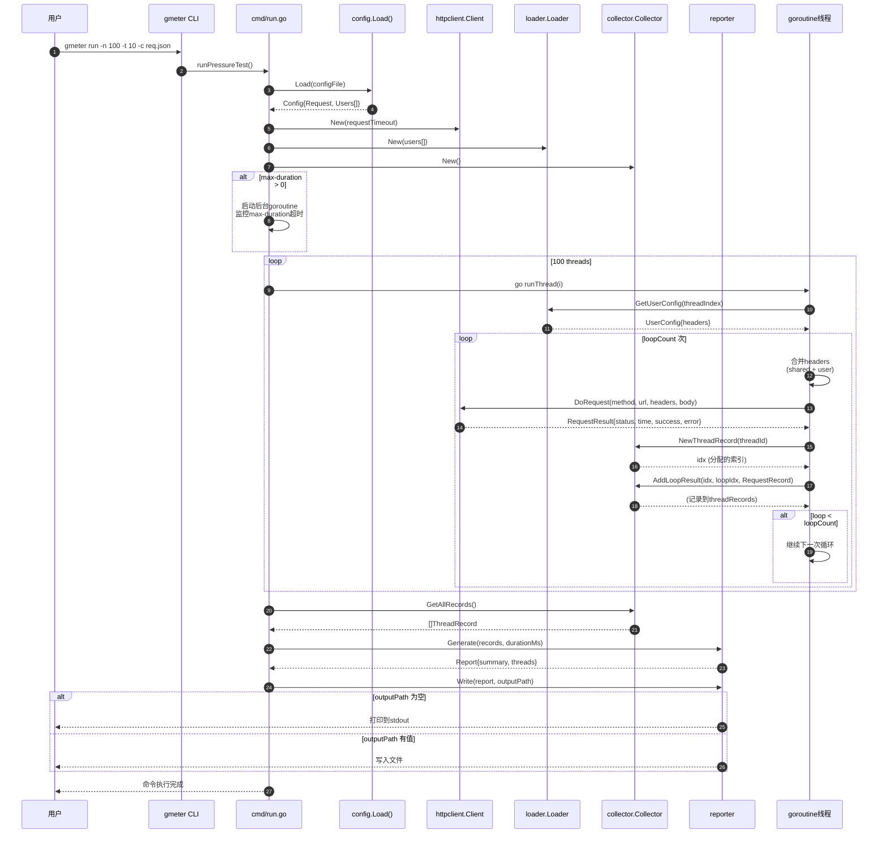

# GMeter 项目架构文档

> 本文档用于帮助理解 gmeter 项目的代码结构和设计思路。

---

## 1. 项目概览

**gmeter** 是一个命令行 HTTP 压测工具，用于学习 Go 语言标准库。

**核心功能：**
- 支持 GET/POST 等 HTTP 方法
- 支持配置文件自定义请求
- 支持多线程并发压测
- 支持 Ramp-Up（渐进式启动线程）
- 支持用户隔离（每个线程使用不同 token）
- 支持 JSON 报告输出

---

## 2. 技术栈

| 技术 | 说明 |
|------|------|
| Go 1.25.1 | 项目语言 |
| spf13/cobra | CLI 框架，用于构建命令行应用 |
| net/http | Go 标准库，HTTP 客户端 |
| encoding/json | Go 标准库，JSON 解析 |
| sync | Go 标准库，并发控制（Mutex、WaitGroup） |

---

## 3. 项目结构

```
gmeter/
├── main.go                      # 程序入口
├── cmd/
│   ├── root.go                 # CLI 根命令
│   └── run.go                  # run 子命令（压测执行入口）
├── internal/
│   ├── config/                 # 配置解析
│   ├── loader/                 # 用户数据加载
│   ├── httpclient/             # HTTP 客户端
│   ├── collector/              # 结果收集
│   └── reporter/               # 报告生成
└── req.json.example            # 配置文件示例
```

---

## 4. 模块详解

### 4.1 main.go（程序入口）

**职责：** 整个程序的入口点，仅调用 `cmd.Execute()`。

```go
package main

import "gmeter/cmd"

func main() {
    cmd.Execute()
}
```

**设计思路：** 保持 main.go 极简，所有逻辑下沉到 cmd 包。

---

### 4.2 cmd/root.go（CLI 根命令）

**职责：** 定义全局 flag 变量和根命令。

**关键知识点：**

#### spf13/cobra 框架
cobra 是 Go 中最流行的 CLI 框架，使用方式：

```go
// 定义一个命令
var rootCmd = &cobra.Command{
    Use:   "gmeter",
    Short: "a pressure testing tool",
}

// 命令执行入口
func Execute() {
    rootCmd.Execute()
}

// 在 init() 中注册子命令和绑定 flag
func init() {
    rootCmd.AddCommand(runCmd)
    runCmd.Flags().IntVarP(&threads, "threads", "n", 0, "Number of threads")
}
```

**cobra 核心概念：**

- `Command`：命令（类似 rootCmd、runCmd）
- `Flags`：命令行参数
- `Args`：参数校验
- `Execute()`：执行命令树的入口

#### IntVarP 绑定
```go
runCmd.Flags().IntVarP(&threads, "threads", "n", 0, "Number of threads")
//     │                │             │       │  │    │
//     │                │             │       │  │    └── 描述
//     │                │             │       │  └────── 默认值
//     │                │             │       └───────── 短参数 -n
//     │                │             └──────────────── 长参数 --threads
//     │                └────────────────────────────── 绑定到的变量
//     └────────────────────────────────────────────── Flag 类型
```

---

### 4.3 cmd/run.go（run 子命令）

**职责：** 整合所有模块，执行完整的压测流程。

**核心流程：**

```
1. 加载配置文件（config.Load）
         ↓
2. 验证参数（线程数、用户数）
         ↓
3. 创建 HTTP 客户端（httpclient.New）
         ↓
4. 创建用户加载器（loader.New）
         ↓
5. 创建结果收集器（collector.New）
         ↓
6. 启动 max-duration 监视器（可选）
         ↓
7. 按 Ramp-Up 策略启动线程（sync.WaitGroup）
         ↓
8. 每个线程执行请求并收集结果
         ↓
9. 生成报告并输出（reporter.Generate + reporter.Write）
```

**关键知识点：**

#### sync.WaitGroup 并发控制
```go
var wg sync.WaitGroup

for i := 0; i < threads; i++ {
    wg.Add(1)                    // 计数器 +1
    go func() {
        defer wg.Done()          // 完成后计数器 -1
        runThread(...)
    }()
}

wg.Wait()                       // 等待所有线程完成
```

#### time.Duration 时间处理
```go
// 时间.Duration 是纳秒为单位
// 常用写法：
time.Duration(5) * time.Second    // 5秒
time.Duration(5000) * time.Millisecond  // 5秒

// 延迟（每个线程启动间隔 rampUp/threads 时间）
time.Sleep(time.Duration(rampUp) * time.Second / time.Duration(threads))
```

#### 定时器（max-duration）
```go
stopCh := make(chan struct{})
if maxDuration > 0 {
    go func() {
        // 延迟 maxDuration 时间后，异步关闭 stopCh
        time.AfterFunc(time.Duration(maxDuration)*time.Second, func() {
            close(stopCh)
        })
    }()
}

// 监听 stopCh
select {
case <-stopCh:
    goto afterLoop  // 跳出启动循环
default:
}
```

---

### 4.4 internal/config/（配置解析）

**职责：** 读取并解析 JSON 配置文件。

**核心结构体：**

```go
type Config struct {
    Request RequestConfig   `json:"request"`   // 共享请求配置
    Users   []UserConfig    `json:"users"`     // 用户配置数组
}

type RequestConfig struct {
    URL     string            `json:"url"`
    Method  string            `json:"method"`
    Headers map[string]string `json:"headers"`
    Body    string            `json:"body"`
}

type UserConfig struct {
    Headers map[string]string `json:"headers"`  // 预留扩展字段
}
```

**关键知识点：**

#### JSON 标签
```go
type Config struct {
    Request RequestConfig `json:"request"`
    //          │
    //          └───────────────────── JSON 字段名
    //
    // 如果字段名一致可以省略标签：
    // Request RequestConfig `json:"request"`
    //
    // omitempty 标签：空值时不输出
    // Body string `json:"body,omitempty"`
}
```

#### json.Unmarshal
```go
func Load(path string) (*Config, error) {
    data, err := os.ReadFile(path)           // 读取文件
    if err != nil {
        return nil, err
    }

    var cfg Config
    err = json.Unmarshal(data, &cfg)        // JSON → 结构体
    if err != nil {
        return nil, err
    }

    return &cfg, nil
}
```

#### os.ReadFile
```go
// 读取整个文件到内存
data, err := os.ReadFile("path/to/file")
// 返回 []byte
```

---

### 4.5 internal/loader/（用户数据加载）

**职责：** 根据线程索引返回对应的用户配置。

**核心逻辑：**
```go
func (l *Loader) GetUserConfig(threadIndex int) config.UserConfig {
    return l.users[threadIndex % len(l.users)]
}
```

**设计思路：** 使用取模实现轮询分配，当线程数超过用户数时自动循环使用。

---

### 4.6 internal/httpclient/（HTTP 客户端）

**职责：** 封装 HTTP 请求，支持超时控制和 header 合并。

**核心结构体：**
```go
type Client struct {
    httpClient *http.Client   // 标准库 HTTP 客户端
    timeout    time.Duration  // 超时时间
}

type RequestResult struct {
    ResponseStatus  int               // HTTP 状态码
    ResponseTimeMs  int64             // 响应时间（毫秒）
    ResponseHeaders map[string]string // 响应头
    Success         bool              // 是否成功（2xx）
    Error           string            // 错误信息
}
```

**关键知识点：**

#### http.NewRequest 创建请求
```go
req, err := http.NewRequest(method, url, body)
// method: "GET", "POST" 等
// url: 完整 URL
// body: io.Reader（GET 为 nil，POST 可用 strings.NewReader）
```

#### context 超时控制
```go
ctx, cancel := context.WithTimeout(context.Background(), c.timeout)
defer cancel()
req = req.WithContext(ctx)  // 请求绑定 context
```

#### Header 合并策略（调用方已合并好）
```go
// headers 已经在 runThread 中合并好了，直接设置到请求
for k, v := range headers {
    req.Header.Set(k, v)
}
```

#### 响应时间测量
```go
start := time.Now()
// ... 执行请求 ...
elapsed := time.Since(start).Milliseconds()
```

#### 响应状态判断
```go
success := resp.StatusCode >= 200 && resp.StatusCode < 300
```

---

### 4.7 internal/collector/（结果收集）

**职责：** 线程安全地收集所有请求结果。

**核心结构体：**
```go
type Collector struct {
    mu           sync.Mutex    // 互斥锁
    threadRecords []ThreadRecord
}

type RequestRecord struct {
    // 单个请求的完整信息
}

type LoopRecord struct {
    LoopIndex int
    Requests  []RequestRecord
}

type ThreadRecord struct {
    ThreadId    int
    LoopResults []LoopRecord
}
```

**关键知识点：**

#### sync.Mutex 互斥锁
```go
type Collector struct {
    mu sync.Mutex
}

// 加锁访问
func (c *Collector) AddLoopResult(...) {
    c.mu.Lock()
    defer c.mu.Unlock()
    // ... 修改 threadRecords ...
}
```

**为什么需要锁？**
多个 goroutine 同时往 collector 写入数据，没有锁会导致数据竞争（data race）。

#### NewThreadRecord 返回索引
```go
func (c *Collector) NewThreadRecord(threadId int) int {
    c.mu.Lock()
    defer c.mu.Unlock()
    c.threadRecords = append(c.threadRecords, ThreadRecord{...})
    return len(c.threadRecords) - 1  // 返回分配的索引
}
```

**返回索引的原因：** 避免并发分配时的索引冲突。

#### GetAllRecords 返回副本
```go
func (c *Collector) GetAllRecords() []ThreadRecord {
    c.mu.Lock()
    defer c.mu.Unlock()
    result := make([]ThreadRecord, len(c.threadRecords))
    copy(result, c.threadRecords)
    return result
}
```

**返回副本的原因：** 防止外部修改内部数据，且并发读取安全。

---

### 4.8 internal/reporter/（报告生成）

**职责：** 根据收集的结果生成 JSON 报告。

**核心结构体：**
```go
type Summary struct {
    TotalThreads        int
    TotalLoops          int
    TotalRequests       int
    SuccessCount        int
    FailCount           int
    SuccessRate         float64
    DurationMs          int64
    AvgResponseTimeMs   float64
    MinResponseTimeMs   int64
    MaxResponseTimeMs   int64
    P50ResponseTimeMs   int64
    P90ResponseTimeMs   int64
    P99ResponseTimeMs   int64
}

type Report struct {
    Summary Summary
    Threads []collector.ThreadRecord
}
```

**关键知识点：**

#### sort.Slice 排序
```go
allResponseTimes := []int64{...}
sort.Slice(allResponseTimes, func(i, j int) bool {
    return allResponseTimes[i] < allResponseTimes[j]
})
```

#### 分位数计算
```go
func percentile(sorted []int64, p int) int64 {
    if len(sorted) == 0 {
        return 0
    }
    // P50: index = 50% 位置
    index := (len(sorted)-1)*p/100 + 1
    if index >= len(sorted) {
        index = len(sorted) - 1
    }
    return sorted[index-1]
}
```

#### json.MarshalIndent 美化输出
```go
data, err := json.MarshalIndent(report, "", "  ")
// 参数2: 前缀（通常为空）
// 参数3: 缩进（2个空格）
```

#### os.WriteFile 写入文件
```go
err = os.WriteFile(path, data, 0644)
// 0644: 文件权限（所有者读写，其他人读）
```

---

## 5. 核心流程图

### 5.1 流程图

```
┌─────────────────────────────────────────────────────────────┐
│                         main.go                             │
│                          ↓                                   │
│                      cmd.Execute()                           │
│                          ↓                                   │
│                    rootCmd.Execute()                         │
│                          ↓                                   │
│                    runCmd.Execute()                          │
│                          ↓                                   │
│                 runPressureTest() ← cmd/run.go              │
└─────────────────────────────────────────────────────────────┘
                              │
                              ↓
        ┌─────────────────────────────────────────────┐
        │  1. config.Load(configFile)                 │
        │     ↓                                        │
        │  2. httpclient.New(timeout)                  │
        │     ↓                                        │
        │  3. loader.New(users)                       │
        │     ↓                                        │
        │  4. collector.New()                         │
        │     ↓                                        │
        │  5. 启动 max-duration 监视器（可选）         │
        │     ↓                                        │
        │  6. for i := 0; i < threads; i++ {          │
        │       ↓                                      │
        │       delay = rampUp / threads               │
        │       sleep(delay)                          │
        │       go runThread(i)  ← 每个线程           │
        │     }                                        │
        │     ↓                                        │
        │  7. wg.Wait() 等待完成                      │
        │     ↓                                        │
        │  8. reporter.Generate(records, duration)     │
        │     ↓                                        │
        │  9. reporter.Write(report, output)          │
        └─────────────────────────────────────────────┘
                              │
                              ↓
        ┌─────────────────────────────────────────────┐
        │              runThread(i)                    │
        │  for loop := 1; loop <= loopCount; loop++ { │
        │    userConfig = loader.GetUserConfig(i)     │
        │    mergedHeaders = merge(shared, user)      │
        │    result = client.DoRequest(...)           │
        │    record = buildRequestRecord(result)      │
        │    collector.AddLoopResult(idx, loop, ...)  │
        │  }                                          │
        └─────────────────────────────────────────────┘
```

### 5.2 命令执行时序图



**时序图说明：**
1. 用户执行 `gmeter run` 命令，CLI 框架将控制权交给 `runPressureTest()`
2. 首先加载配置文件，解析出共享请求配置和用户配置数组
3. 创建 HTTP 客户端、用户加载器、结果收集器
4. 如果设置了 `max-duration`，启动后台 goroutine 进行超时监控
5. 主循环按 Ramp-Up 策略启动 100 个 goroutine（每个间隔 `rampUp/threads` 秒）
6. 每个 goroutine 内部：
   - 通过 Loader 获取当前线程对应的用户配置
   - 合并请求头（共享 + 用户特定）
   - 调用 HTTPClient 发送请求
   - 将请求结果记录到 Collector（加锁保护）
7. 所有线程完成后，从 Collector 获取所有记录
8. 调用 Reporter 生成报告并输出到指定位置

---

## 6. 设计原则

### 6.1 模块化
每个包职责单一，可独立测试和使用。

### 6.2 错误即结果
请求失败也是一种合法结果，都会记录到报告中。

### 6.3 并发安全
collector 使用 Mutex 保护共享数据。

### 6.4 YAGNI
不做过度抽象，能简单实现就不复杂化。
